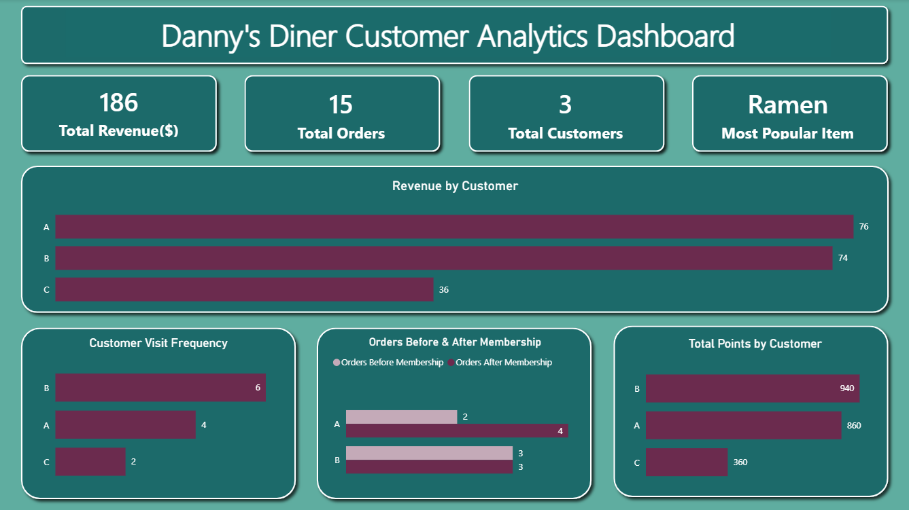

# 🍜 SQL Case Study: Danny's Diner Analysis
> Part of the [8 Week SQL Challenge](https://8weeksqlchallenge.com/) by Danny Ma

---

## 📌 Project Overview
This repository contains the SQL architecture, business analysis, and Power BI dashboard for Danny's Diner, a fictional restaurant looking to leverage customer data to optimize operations, marketing campaigns, and a new loyalty program.

The primary objective was to extract actionable insights regarding customer visitation patterns, product popularity, and promotional campaign effectiveness.

---

## 📊 Dashboard Preview



> Built in Power BI using the cleaned SQL data. Download the [interactive report](./danny_diner_dashboard.pbix) to explore it in Power BI Desktop.

---

## 🛠️ Technical Competencies Demonstrated
- **Database Architecture:** Relational mapping (JOIN, LEFT JOIN) and schema initialization
- **Complex Aggregation:** Multi-dimensional grouping, SUM, COUNT(DISTINCT)
- **Advanced Filtering:** Chronological logic, BETWEEN, EXTRACT, Interval math
- **Window Functions:** Deployed RANK() to handle edge cases like tied purchase volumes and same-day chronologies without dropping records
- **Conditional Logic:** Built dynamic multipliers using CASE WHEN statements to calculate multi-tier loyalty points dynamically
- **Query Optimization:** Refactored heavily nested CTEs into single-pass query architectures to reduce table scans
- **Data Visualization:** Translated SQL insights into an interactive Power BI dashboard

---

## 🗄️ Database Schema
The analysis operates across three core tables:

- **sales** — Captures customer-level transactional data
- **menu** — Product dimension table containing items and pricing
- **members** — Tracks the exact join date of customers enrolled in the loyalty program

---

## 💡 Highlighted Business Solutions

### Identifying Target Acquisition Products
**Business Request:** Determine the very first item purchased by each customer to identify effective acquisition hooks.

```sql
WITH rank AS (
    SELECT 
        s.customer_id, 
        m.product_name, 
        RANK() OVER (PARTITION BY s.customer_id ORDER BY s.order_date ASC) as ranks
    FROM dannys_diner.sales s
    JOIN dannys_diner.menu m USING (product_id)
)
SELECT DISTINCT 
    customer_id, 
    product_name
FROM rank
WHERE ranks = 1;
```

---

### 🏆 The Challenge Query: Complex Promotional Point Calculation
**Business Request:** Calculate total points for January. Customers earn 10x points per dollar spent. Sushi permanently earns 20x points. However, for the first 7 days after a customer joins the loyalty program (including their join date), all purchases earn 20x points.

This was the most technically demanding ticket in the case study due to intersecting temporal conditions, varying multipliers, and the need to include non-members. I developed two distinct solutions to demonstrate both step-by-step logical staging and advanced query optimization.

**Approach 1: Modular CTE Architecture** — breaks the complex timeline into distinct chronological buckets (pre_promo, promotion, post_promo, non_members). Highly readable, modular, and demonstrates strong CTE proficiency. Full solution in `solution.sql`.

**Approach 2: Single-Pass Optimization** — refactored into a single-pass query by moving temporal logic directly into the SUM() aggregation. The engine evaluates every row exactly once, eliminating the multi-scan bottleneck while returning the exact same output.

```sql
SELECT 
    s.customer_id,
    SUM(
        CASE 
            WHEN s.order_date BETWEEN m.join_date AND (m.join_date + INTERVAL '6 days') THEN m2.price * 20
            WHEN m2.product_name = 'sushi' THEN m2.price * 20
            ELSE m2.price * 10 
        END
    ) AS total_points
FROM dannys_diner.sales s
JOIN dannys_diner.menu m2 USING (product_id)
LEFT JOIN dannys_diner.members m USING (customer_id)
WHERE EXTRACT(MONTH FROM s.order_date) = 1
GROUP BY s.customer_id
ORDER BY s.customer_id;
```

---

## 📂 Files
| File | Description |
|---|---|
| `Schema.SQL` | Database schema and seed data |
| `solution.sql` | All query solutions |
| `danny_diner_dashboard.pbix` | Interactive Power BI report |
| `danny_diner_dashboard.png` | Dashboard preview image |

---

*Solutions by [Owen Ebuehi](https://www.linkedin.com/in/owenebuehi)*
